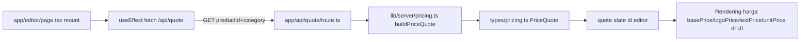
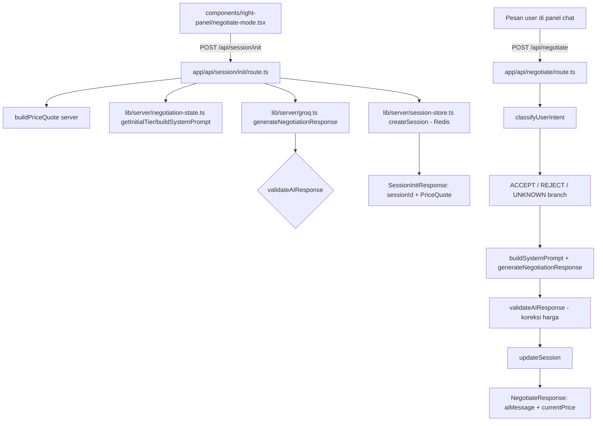
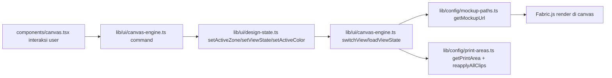

# ARCHITECTURE.md

Dokumen onboarding untuk developer frontend & backend yang baru bergabung. Baca ini
sebelum menulis kode — tujuannya supaya kamu paham arah kode dalam hitungan menit, bukan jam.

---

## A. Ringkasan Sistem

Produk ini adalah **editor desain kaos custom** (brand "Ashirah Group") yang menggabungkan
kanvas desain interaktif (Fabric.js), negosiasi harga berbasis AI (chatbot), dan checkout
pembayaran (Midtrans) dalam satu monolit modular Next.js.

- **Stack:** Next.js 16 (App Router, Turbopack), React 19, TypeScript, Fabric.js 7, Zustand 5,
  Groq (SDK `groq-sdk`) untuk asisten AI, Midtrans untuk pembayaran, Upstash Redis untuk
  penyimpanan sesi.
- **Monolith, satu repo:** codebase dibagi per *ownership* (lihat Section B) tapi berjalan
  dalam satu aplikasi.
- **Prinsip kunci:** **harga selalu server-authoritative.** Klien tidak pernah menghitung atau
  mengirim harga final; semua harga bersumber dari `lib/server/pricing.ts` dan dikirim lewat
  endpoint API. Frontend hanya render hasilnya.
- **Kontrak ketat frontend/backend:** Frontend tidak boleh import dari `lib/server/`. Semua
  tipe request/response API didefinisikan satu kali di `types/`.

---

## B. Peta Ownership Folder

| Folder | Pemilik | Isi |
|---|---|---|
| `lib/server/` | Backend | Logic yang **wajib** jalan di server (tidak boleh diimport frontend). File aktual: `pricing.ts` (kalkulasi harga & sumber kebenaran harga), `negotiation-state.ts` (tier diskon, intent user, buildSystemPrompt, `validateAIResponse`), `session-store.ts` (interface + persist `NegotiationSession`, backend Redis), `groq.ts` (gateway model AI + retry), `ai-vision.ts` (**STUB** — lihat catatan di bawah). |
| `lib/config/` | Bersama (butuh koordinasi) | Konstanta/kontrak bersama yang boleh diakses frontend **dan** backend. File aktual: `products.ts` (katalog produk + `basePrice` per produk), `zones.ts` (daftar zona & labelnya), `print-areas.ts` (area print per zona + `getPrintArea`), `mockup-paths.ts` (path/lokasi gambar mockup via `getMockupUrl`). |
| `lib/ui/` | Frontend | State & helper canvas sisi client. File aktual: `canvas-engine.ts` (singleton Fabric.js: load mockup, print-area clip, layer, view state), `design-state.ts` (kanal state terpusat: active zone/view states/color — di luar React, karena engine canvas bersifat imperatif), `utils.ts` (`cn` helper untuk komponen UI). |
| `types/` | Bersama (kontrak) | Tipe request/response API & tipe domain. File aktual: `pricing.ts` (`PriceQuote`), `api.ts` (`SessionInitResponse`, `SessionStatusResponse`, `NegotiateResponse`), `chat.ts` (`ChatMessage`), `design.ts` (`CanvasZone`, `ViewStateRecord`, `DesignState`), `print-area.ts` (`PrintArea`), `vision.ts` (kontrak AI Vision, lihat catatan di bawah), `midtrans-client.d.ts` (deklarasi jenis untuk package midtrans). |
| `components/` | Frontend | Komponen React: `canvas.tsx` (kanvas + view switcher), `left-panel.tsx` (+ sub-panel di `left-panel/`), `right-panel.tsx` (+ `right-panel/negotiate-mode.tsx`, `review-mode.tsx`), `header.tsx`, `product-switcher-dialog.tsx`, panel mobile (`mobile-*`), dan primitives generik di `components/ui/` (`button`, `dialog`, `tabs`, `badge`, `coming-soon`). |
| `app/api/` | Backend | Route handler (server). Route aktual: `quote` (GET harga), `session/init` (POST buat sesi negosiasi + quote), `session/status` (status sesi/polling), `negotiate` (POST pesan negosiasi), `payment/create` (POST buat pembayaran Midtrans). |

> **Catatan `lib/server/ai-vision.ts` & `types/vision.ts`:** keduanya **status STUB — belum
> aktif / belum dipakai**. Belum terhubung ke provider AI Vision (OpenRouter/Gemini/Claude)
> dan belum diintegrasikan ke alur harga. Jangan bingung saat fungsi cuma return nilai default.

---

## C. Aturan Emas (Golden Rules) — WAJIB Dibaca Sebelum Ngoding

1. **Harga TIDAK pernah dihitung di client.** Semua harga berasal dari `lib/server/pricing.ts`
   (`buildPriceQuote`, `getUnitPrice`) dan dikirim lewat endpoint (`/api/quote`,
   `/api/session/init`). Frontend hanya render hasilnya. Jangan pernah hardcode harga di
   komponen/state.
2. **Frontend TIDAK boleh import langsung dari `lib/server/`.** Semua akses back-end lewat
   API route. (Depan boleh pakai `lib/config/` untuk konstanta bersama.)
3. **Tipe request/response API didefinisikan di `types/`, bukan didefinisikan ulang di
   masing-masing file.** Kalau butuh tipe yang belum ada, tambahkan di `types/`, jangan inline.
4. **AI hanya boleh "bicara harga" sesuai yang sudah dihitung di server.** Output AI chatbot
   selalu melewati `validateAIResponse` (`lib/server/negotiation-state.ts`) yang mengoreksi
   harga yang salah/salah-sebut dan hanya boleh menyebut harga yang sudah divalidasi server.
   Intent user diklasifikasi dulu lewat `classifyUserIntent` di `/api/negotiate` (bukan
   teks mentah) — prinsip anti-prompt-injection: harga tidak pernah ditentukan oleh model.
5. **Harga katalog (`basePrice`) didefinisikan di `lib/config/products.ts`**, dan **hanya**
   `lib/server/pricing.ts` yang boleh mengubahnya jadi harga jual. Jangan duplikasi konstanta
   harga di tempat lain.
6. **State canvas dipegang `lib/ui/design-state.ts`** (di luar React) karena engine Fabric.js
   imperatif. Komponen angka menggunakan Zustand (`components/canvas.tsx` memakai
   `useDesignStore`) untuk sinyal ke React.

---

## D. Diagram Alur Data (Mermaid)

### Alur harga: editor memuat kanvas → harga dari server



Editor tidak menghitung harga; ia hanya menunggu `quote` dari `/api/quote` (race-safe via flag
`cancelled`). Sambil menunggu, harga render 0 (fallback).

### Alur negosiasi: customer bertransaksi di panel chat



### Alur state canvas (frontend)



State React (Zustand) dan state engine (design-state) berjalan paralel; `canvas.tsx`
menjembatani keduanya.

---

## E. Peta "Kalau Mau Ubah X, Buka File Y"

| Mau ubah... | Buka file |
|---|---|
| Harga dasar produk / logo / teks / unit | `lib/server/pricing.ts` (`buildPriceQuote`, `getUnitPrice`, `LOGO_PRICE`, `TEXT_PRICE`) |
| Tipe kalkulasi harga dikirim ke client | `types/pricing.ts` (`PriceQuote`) |
| Harga katalog per produk (`basePrice`) | `lib/config/products.ts` |
| Daftar zona & labelnya (Depan/Belakang/dst) | `lib/config/zones.ts` (`ZONE_OPTIONS`, `getZoneLabel`) |
| Path/lokasi mockup per warna×zona | `lib/config/mockup-paths.ts` (`getMockupUrl`) |
| Tipe data print area | `types/print-area.ts` (`PrintArea`) |
| Area print per zona / per kategori+warna | `lib/config/print-areas.ts` (`getPrintArea`, `PRINT_AREAS_BY_ZONE`) |
| Tampilan kanvas & interaksi (view switcher, hapus objek) | `components/canvas.tsx`, `lib/ui/design-state.ts` |
| Logic Fabric.js (load mockup, clip, layer, view state) | `lib/ui/canvas-engine.ts` |
| Tipe sesi / response API | `types/api.ts`, `types/session` (di `lib/server/session-store.ts`) |
| Tier diskon, intent user, prompt AI | `lib/server/negotiation-state.ts` |
| Model AI / retry gateway | `lib/server/groq.ts` |
| Analisis kerumitan desain (AI Vision) | `lib/server/ai-vision.ts` (**STUB** — belum aktif) + `types/vision.ts` |
| Buat/poll sesi negosiasi | `app/api/session/init/route.ts`, `app/api/session/status/route.ts` |
| Alur chat negosiasi | `app/api/negotiate/route.ts`, `components/right-panel/negotiate-mode.tsx` |
| Pembayaran Midtrans | `app/api/payment/create/route.ts`, `app/payment/success/page.tsx` |

---

## F. Known Limitations / Backlog

Item berikut sengaja TIDAK diperbaiki di fase P1–P3; jangan bingung kalau terlihat belum
selesai. Jangan "bereskan" tanpa instruksi eksplisit.

1. **3 error TypeScript pre-existing** (sudah ada sebelum refactor, di luar scope):
   - `app/design/[category]/page.tsx` baris 46 — `onAddToCart` missing pada tipe `HeaderProps`.
   - `components/mobile-right-panel-sheet.tsx` baris 146 — `RefObject<HTMLDivElement|null>`
     tidak assignable ke `RefObject<HTMLDivElement>`.
   - `components/right-panel.tsx` baris 99 — masalah `RefObject` yang sama.
2. **Belum ada ESLint config.** Script `npm run lint` didefinisikan tapi tidak ada config-nya.
   Quality gate yang dipakai: `npx tsc --noEmit` + `npm run build`.
3. **Tool desain masih status "Segera Hadir" (stub UI, nonaktif):** panel `add-text`,
   `clip-art`, `template`, `my-images` — dirender lewat `components/ui/coming-soon.tsx`
   dalam state disabled. Tombol **"Simpan Template"** di `components/header.tsx` juga
   nonaktif (desktop: disabled + chip "Segera Hadir"; mobile: disabled).
4. **AI Vision (`lib/server/ai-vision.ts`) status STUB** — belum terhubung ke provider, belum
   dipakai di alur harga (lihat Section B catatan).

---

## G. Quickstart

Install & jalankan lokal:

```bash
npm install
npm run dev        # http://localhost:3000
```

Command lain di `package.json`:

```bash
npm run build      # next build (production)
npm run start      # next start (jalankan hasil build)
npm run lint       # eslint . (SAAT INI TANPA CONFIG — gunakan tsc sebagai gantinya)
```

Quality gate sebelum push (harus lolos, tidak ada error baru selain 3 backlog di Section F):

```bash
npx tsc --noEmit
npm run build
```

Environment yang dibutuhkan (lihat `.env.local`): `GROQ_API_KEY` untuk asisten AI chatbot.
Midtrans & Upstash Redis dipakai untuk pembayaran & persist sesi (mengikuti konfigurasi yang
sudah ada); pastikan dispakai value yang sesuai sebelum endpoint terkait diuji.
