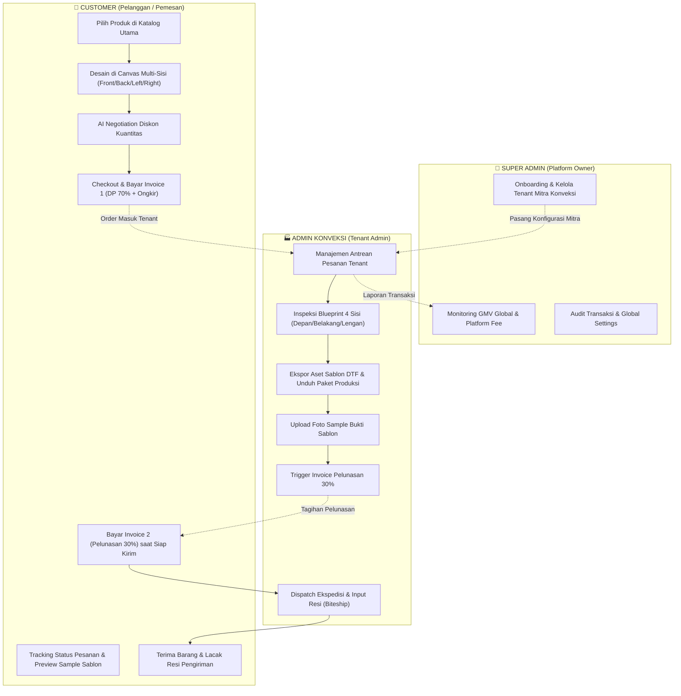

# Master Analisis Proyek: Ashirah Custom Apparel Platform
**Status Dokumen:** Aktif & Terverifikasi  
**Tanggal Update:** 24 September 2026  
**Arsitektur Inti:** Next.js 16 (App Router), Fabric.js Canvas Engine, Drizzle ORM + PostgreSQL, Duitku Gateway (70:30 Split), Biteship Logistics.

---

## 1. Arsitektur & Alur Kerja 3 Role Pengguna

---

### A. Alur Pelanggan (Customer / Pemesan)
1. **Katalog Produk (`/`):**
   - Pelanggan melihat etalase produk konveksi (Kaos Polos, Polo, Hoodie, Jersey).
   - Mengetahui batas MOQ (*Minimum Order Quantity*), harga satuan bertingkat, dan spesifikasi bahan kain.
2. **Editor Kanvas Multi-Sisi (`/editor`):**
   - Memilih varian warna kain dan sisi kaos: **Depan**, **Belakang**, **Lengan Kiri**, dan **Lengan Kanan**.
   - Mengunggah gambar/logo, menambahkan teks kustom (font, warna, ukuran), dan mengatur tata letak pada area cetak aman (*Safe Print Area*).
   - Setiap sisi bersifat independen (desain sisi depan tidak bocor ke belakang atau lengan).
   - Melakukan simulasi tawar-menawar harga grosir dengan asisten AI berdasarkan kuantitas pesanan.
3. **Checkout & Pembayaran Termin 1 (`/checkout`):**
   - Menentukan kuantitas per ukuran (S, M, L, XL, XXL) yang memenuhi MOQ.
   - Menginput alamat pengiriman lengkap.
   - Membayar **Invoice 1: DP 70% + Ongkos Kirim** melalui Duitku Payment Gateway (Virtual Account, QRIS, E-Wallet).
4. **Pelacakan & Pelunasan (`/orders`):**
   - Memantau tahapan pesanan: *Menunggu DP* ➔ *DP Lunas* ➔ *Diproduksi* ➔ *Siap Dikirim* ➔ *Dalam Pengiriman* ➔ *Selesai*.
   - Melihat pratinjau foto sample fisik sablon yang diunggah oleh admin konveksi sebelum pelunasan.
   - Membayar **Invoice 2: Pelunasan 30%** saat pesanan berstatus siap dikirim.
   - Memantau nomor resi kurir hingga barang sampai di tujuan.

---

### B. Alur Admin Konveksi (Tenant Admin)
1. **Daftar Pesanan Masuk (`/admin/orders`):**
   - Admin login di bawah tenant konveksi miliknya (*Ashira Garment & Konveksi*).
   - Sistem menerapkan proteksi isolasi data: admin hanya melihat pesanan milik tenant-nya sendiri.
2. **Detail Pesanan & Visualisasi Blueprint DTF (`/admin/orders/[id]`):**
   - **Kanvas Auto-Fit Multi-Sisi:** Memeriksa tampilan kaos dan letak sablon di ke-4 sisi dengan ukuran besar dan proporsional (*fit-to-box*).
   - **Koordinat Sablon Presisi:** Mengetahui posisi X, Y, rotasi, ukuran cetak piksel, dan font teks untuk operator cetak.
   - **Unduh Gambar Mentah:** Mengunduh file asli customer tanpa kompresi untuk diumpankan ke software RIP printer DTF.
   - **Modal Blueprint Vendor:** Mengunduh paket arsip lengkap (mockup 4 sisi, file JSON spesifikasi teknis mesin DTF, dan gambar mentah).
3. **Operasional Produksi & Pengiriman:**
   - **Konfirmasi Pembayaran:** Memverifikasi status pembayaran DP 70% (otomatis via webhook atau bypass konfirmasi manual).
   - **Bukti Sample Sablon:** Mengunggah foto sample hasil cetak kain pertama untuk divalidasi pemesan.
   - **Tagihan Pelunasan:** Mengaktifkan tagihan 30% saat barang selesai dijahit & disablon.
   - **Ekspedisi & Resi:** Menghubungkan kurir via Biteship (JNE, J&T, SiCepat, AnterAja) atau input nomor resi fisik manual.
   - **Catatan Internal:** Menuliskan memo khusus internal (kode rol kain, catatan benang, memo QC).

---

### C. Alur Super Admin (Platform Owner / Ashira Master)
1. **Pusat Kendali Global Platform (`/super-admin`):**
   - Memantau performa seluruh ekosistem: Total GMV platform, total transaksi, total mitra konveksi aktif, dan pendapatan *Platform Fee*.
   - Grafik analitik pertumbuhan pesanan dan volume transaksi bulanan.
2. **Manajemen Klien Konveksi (`/super-admin/clients`):**
   - Mendaftarkan (*onboarding*) mitra konveksi baru (nama pabrik, slug URL, kontak, alamat workshop, pengaturan MOQ).
   - Mengatur persentase bagi hasil / komisi platform per tenant.
   - Membekukan (*suspend*) tenant yang tidak mematuhi SLA produksi.
3. **Audit Transaksi (`/super-admin/transactions`):**
   - Memantau riwayat seluruh pembayaran DP & Pelunasan lintas konveksi.
   - Rekonsiliasi pencairan dana (*settlement*) dari gateway pembayaran ke rekening konveksi.
4. **Pengaturan Sistem Global (`/super-admin/settings`):**
   - Mengelola kunci integrasi Duitku Gateway, API Biteship, WhatsApp gateway, dan email SMTP notifikasi.

---

## 2. Status Progress yang Sudah Selesai (Completed Milestones)

| Bagian | Fitur yang Sudah Selesai | Status |
| :--- | :--- | :---: |
| **Multi-Tenancy** | Resolusi tenant otomatis pada pemesanan (`user.tenantId` ➔ `ashira-garment`). Menghilangkan bug "pesanan salah kamar". | ✅ Selesai |
| **Canvas Multi-Sisi** | Isolasi 4 zona (`front`, `back`, `left`, `right`). Aset tidak saling bocor saat switch view. | ✅ Selesai |
| **Ekstraksi Blueprint** | Struktur data `BlueprintSnapshot` menyimpan ke-4 sisi lengkap dengan posisi dan koordinat cetak DTF. | ✅ Selesai |
| **Admin Blueprint Viewer** | Tab Depan, Belakang, Lengan Kiri, Lengan Kanan dengan indikator dot hijau & kanvas *Auto-Fit* proporsional. | ✅ Selesai |
| **Modal Blueprint Vendor** | Pratinjau 4 sisi sekaligus berdampingan, tombol unduh mockup beresolusi tinggi, unduh blueprint JSON, dan paket lengkap. | ✅ Selesai |
| **Sistem Pembayaran 70:30** | Pembuatan tagihan Invoice 1 (DP 70% + Ongkir) dan Invoice 2 (Pelunasan 30%) dengan integrasi Duitku. | ✅ Selesai |
| **Desain & Palet Warna** | Standarisasi tombol pill `rounded-full` Navy (`#1A2B56`, hover `#243B6B`), latar putih bersih, **bebas warna oranye/amber**. | ✅ Selesai |

---

## 3. Analisis Gap (Hal yang Belum Sempurna & Rencana Solusi)

Berikut adalah daftar celah (*gaps*) yang perlu disempurnakan:

### 🔴 Gap 1: Skala Mockup & Area Sablon Punggung (Back Zone Calibration)
* **Kondisi Saat Ini:**
  Mockup kaos belakang memiliki target bounding box `358 × 503 px` dan area print hanya `200 × 270 px`. Sedangkan tampak depan `398 × 513 px` dan area print `220 × 280 px`.
* **Dampak:**
  Kaos belakang terlihat sedikit lebih kecil/kurus dibanding depan, dan sablon punggung tidak bisa membentang lebar (lebar maksimal hanya 200 px).
* **Solusi Rencana:**
  Sesuaikan `GARMENT_TARGET_BOX_BY_ZONE.back` di `canvas-engine.ts` menjadi `410 × 520 px` dan lebarkan `PRINT_AREAS_BY_ZONE.back` menjadi `260 × 320 px` (standar sablon A3 punggung).

---

### 🟡 Gap 2: Sinkronisasi Status Produksi dengan Notifikasi Customer (WhatsApp/Email)
* **Kondisi Saat Ini:**
  Ketika admin konveksi mengubah status ke `ready` atau mengunggah resi pengiriman, helper WhatsApp (`lib/server/whatsapp.ts`) dan Email (`lib/server/email.ts`) sudah ada kodenya, namun kredensial API belum terhubung ke gateway WhatsApp riil (seperti Fonnte / Waha).
* **Dampak:**
  Customer harus mengecek halaman `/orders` secara manual untuk mengetahui status pelunasan dan nomor resi.
* **Solusi Rencana:**
  Integrasikan webhook/service WhatsApp gateway aktif agar customer menerima pesan otomatis saat invoice 30% terbit dan saat resi diinput.

---

### 🟡 Gap 3: Penanganan Aset Resolusi Sangat Besar (Storage Cloud vs Local Base64)
* **Kondisi Saat Ini:**
  Gambar yang diunggah customer saat ini disimpan dalam bentuk `base64 dataURL` di dalam kolom `jsonb` database PostgreSQL.
* **Dampak:**
  Jika customer mengunggah 4 gambar masing-masing berukuran 10 MB, ukuran JSON blueprint di database bisa membengkak (>40 MB per order), membebani query PostgreSQL.
* **Solusi Rencana:**
  Tambahkan middleware kompresi gambar kanvas client-side sebelum disimpan, atau alihkan penyimpanan gambar mentah ke Object Storage (S3 / Cloudinary / Supabase Storage).

---

### 🟢 Gap 4: Tampilan Mobile Responsif pada Modal Blueprint Vendor
* **Kondisi Saat Ini:**
  Pada layar desktop, grid 4 kolom berjalan sempurna. Pada layar smartphone (<640px), modal menggunakan scroll vertikal yang agak panjang.
* **Solusi Rencana:**
  Tambahkan tab navigasi horizontal ringkas untuk pratinjau zona pada tampilan mobile di modal vendor.

---

## 4. Prioritas Eksekusi Selanjutnya

1. **Prioritas 1 (Quick Win):** Kalibrasi skala kaos belakang dan perluas area cetak sablon punggung (A3) pada `canvas-engine.ts` dan `print-areas.ts`.
2. **Prioritas 2 (Usability):** Optimalisasi kompresi penyimpanan aset gambar agar database tetap ringan dan cepat.
3. **Prioritas 3 (Feature):** Uji coba alur transaksi end-to-end simulasi dari checkout customer ➔ pembayaran DP ➔ produksi admin ➔ pelunasan 30% ➔ pengiriman Biteship.
